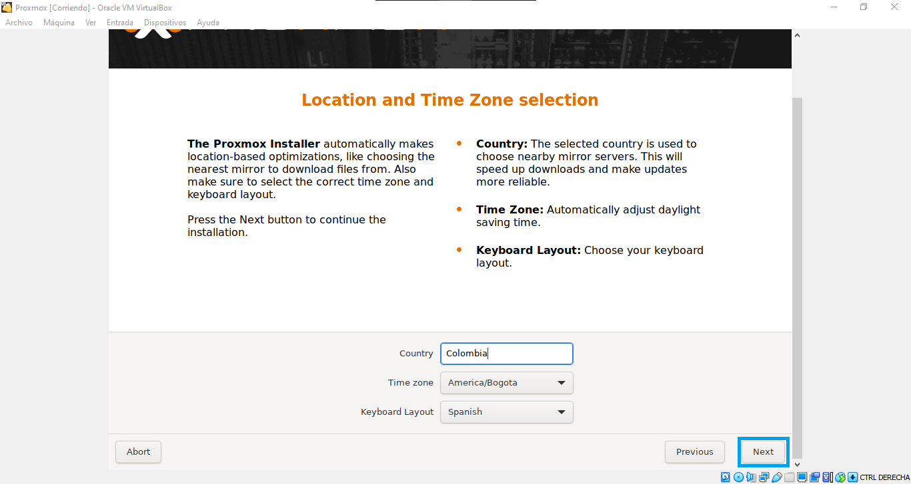
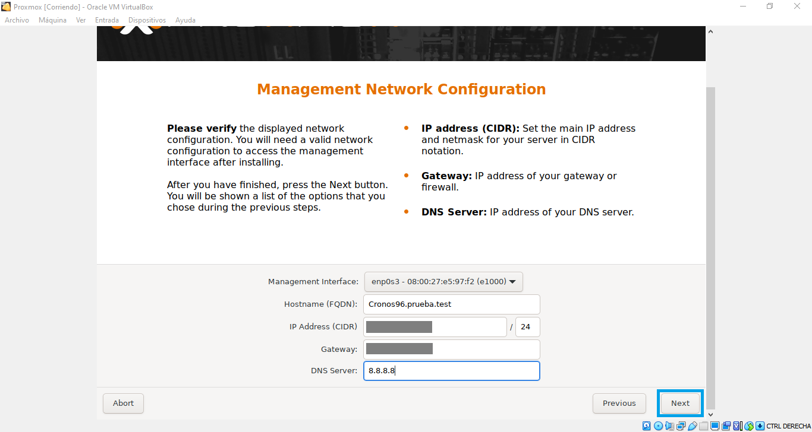
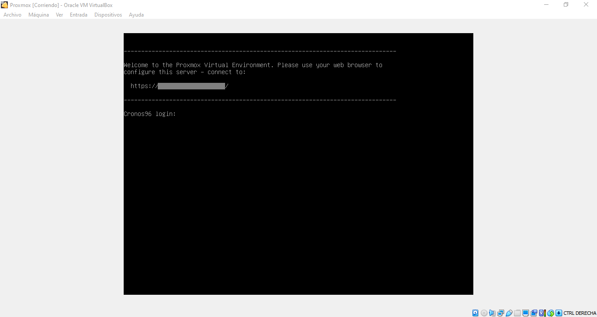
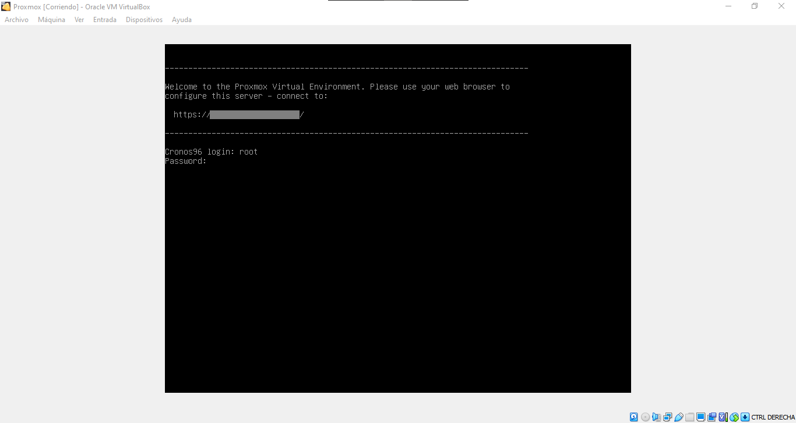
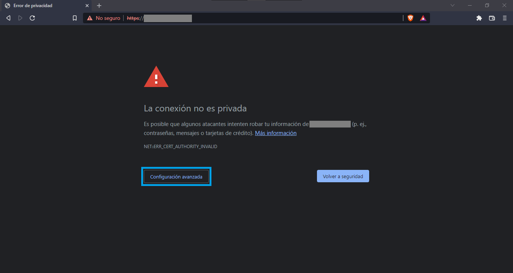
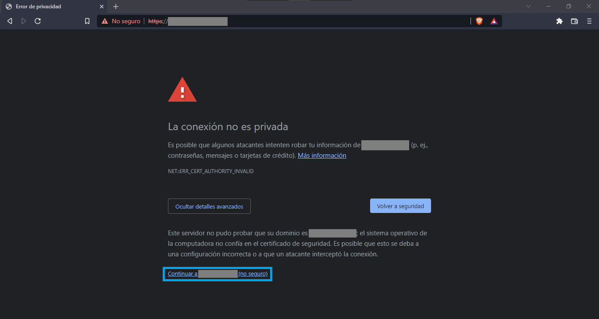
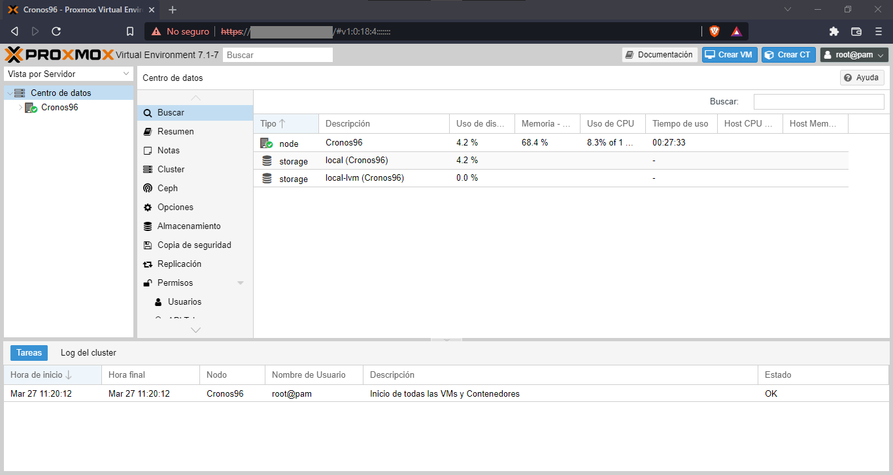

# <b>¿Que es Proxmox VE?</b>

Proxmox Virtual Environment o mejor conocido como [Proxmox VE][1_0] o PVE, es un servidor de [código abierto][1_1] que nos permite virtualizar y gestionar otros sistemas operativos, este servidor fue desarrollado por medio de una distribución de [GNU/Linux][1_2] basada en [Debian][1_3], la cual usa también un kernel modificado de [Ubuntu][1_4] LTS para así poder ejecutar varias [máquinas virtuales][1_5] y [contenedores][1_6] en un solo servidor, Proxmox VE también incluye una consola web y  herramientas de líneas de comandos qué garantizan una accesibilidad simple y rápida.

Su proveedor Proxmox Server Solitions GmbH, es una empresa distribuidora de software de código abierto que fue fundada por Martin Maurer y Dietmar Maurer en el año 2005, actualmente es una empresa independiente que se dedica a desarrollar soluciones de servidor potente y eficientes. Las cuales son ampliamente utilizadas en empresas independientemente de su tamaño, sector o industria, así como en ONG y en el sector educativo.

Con sus dos productos principales, Proxmox Virtual Environment (Proxmox VE) y Proxmox Mail Gateway, la empresa ofrece un software flexible, asequible y fácil de usar para empresas que implementan infraestructuras de TI seguras y de código abierto. Además de ofrecer servicios como suscripciones comerciales y capacitaciones. Contando así con una red mundial de socios y una gran comunidad activa que garantizan la continuidad del negocio para sus usuarios.

[1_0]:https://es.wikipedia.org/wiki/Proxmox_Virtual_Environment

[1_1]:https://es.wikipedia.org/wiki/Software_de_c%C3%B3digo_abierto

[1_2]:https://es.wikipedia.org/wiki/Distribuci%C3%B3n_Linux

[1_3]:https://es.wikipedia.org/wiki/Debian_GNU/Linux

[1_4]:https://es.wikipedia.org/wiki/Ubuntu

[1_5]:https://es.wikipedia.org/wiki/M%C3%A1quina_virtual

[1_6]:https://es.wikipedia.org/wiki/Virtualizaci%C3%B3n_a_nivel_de_sistema_operativo

# <b>Ventajas de Proxmox VE</b>

* Facilita la administración de máquinas y contenedores virtuales a través de la interfaz de administración web.

* Puede escalar dinámicamente los recursos de almacenamiento, satisfaciendo las demandas de su organización, reduciendo la eficiencia y los costos.

* Posee integración con el hipervisor KVM y LXC la cual permite la virtualización de las cargas de trabajo de aplicaciones de Linux y Windows más exigentes.

* Con el uso del complemento Proxmox de Bacula Enterprise, puede acceder a las capacidades de copia de seguridad de recuperación de datos más robustas y rentables del mercado. Además de permitir la recuperación ante desastres (DR) de máquinas virtuales, incluidos los invitados QEMU y LXC.

* Realiza una copia de seguridad en línea basada en la instantánea de cualquier máquina virtual invitada, incluidos QEMU y LXC.

* Permite la copia de seguridad de imagen completa y posee la capacidad para restaurar una imagen de máquina virtual completa.

* Permite la restauración opcional de archivos de máquina virtual QEMU (.vma) en un directorio alternativo.

* Permite la recuperación de archivos y configuraciones de máquinas virtuales LXC (.tar) en directorios alternativos.

# <b>Modelo de lanzamiento proxmox 7.1</b>

Esta versión de proxmox se basa en Debian 11.1 "Bullseye" y utiliza el kernel de Linux 5.13 más reciente, QEMU 6.1, LXC 4.0, Ceph 16.2.6 y OpenZFS 2.1. e innumerables mejoras y correcciones de errores que podemos encontrar en el [Roadmap][1_7] de la página oficial.

Además de contar con varias funcionalidades nuevas y muchas mejoras para las tareas de administración en la interfaz web: soporte para Windows 11, incluido TPM, asistente de creación mejorado para VM/contenedor, capacidad para establecer políticas de retención de respaldo por trabajo de respaldo en la GUI y un nuevo programador daemon que admite horarios más flexibles, entre otros aspectos más destacados tales como:

* LXC 4.0, Ceph 16.2.6, QEMU 6.1 y OpenZFS 2.1.

* Asistente de VM con valores predeterminados para Windows 11 (q35, OVMF, TPM).

* Nuevo programador de copias de seguridad para opciones de programación flexibles.

* Retención de copias de seguridad.

* Bandera de protección para copias de seguridad.

* Autenticación de dos factores: WebAuthn, claves de recuperación, múltiples factores para una sola cuenta.

* Nuevas plantillas de contenedores: Fedora, Ubuntu, Alma Linux, Rocky Linux.

[1_7]:https://pve.proxmox.com/wiki/Roadmap#Proxmox_VE_7.1

# <b>Requisitos del sistema</b>

Para servidores de producción, se necesita equipo de servidor de alta calidad. Proxmox VE admite la agrupación en clústeres, lo que significa que varias instalaciones de Proxmox VE se pueden administrar de forma centralizada gracias a la funcionalidad de clúster integrada. Proxmox VE puede usar almacenamiento local como (DAS), SAN, NAS, así como almacenamiento compartido y distribuido (Ceph).

## <b>Hardware recomendado</b>

* Intel EMT64 o AMD64 con indicador de CPU Intel VT/AMD-V.

* Memoria, mínimo 2 GB para servicios OS y Proxmox VE. Más memoria designada para invitados. Para Ceph o ZFS se requiere memoria adicional, aproximadamente 1 GB de memoria por cada TB de almacenamiento utilizado.

* Almacenamiento rápido y redundante, mejores resultados con discos SSD.

* Almacenamiento del sistema operativo: RAID de hardware con caché de escritura protegida por baterías ("BBU") o no RAID con caché ZFS y SSD.

* Almacenamiento de VM: para el almacenamiento local, use un RAID de hardware con caché de escritura respaldada por batería (BBU) o no RAID para ZFS. Ni ZFS ni Ceph son compatibles con un controlador RAID de hardware. El almacenamiento compartido y distribuido también es posible.

* NIC Gbit redundantes, NIC adicionales según la tecnología de almacenamiento preferida y la configuración del clúster: también se admiten 10 Gbit y más.

* Para el paso a través de PCI(e), se necesita una CPU con indicador de CPU VT-d/AMD-d.

## <b>Hardware mínimo (solo para pruebas)</b>

* CPU: 64 bits (Intel EMT64 o AMD64).

* CPU/placa base compatible con Intel VT/AMD-V (para soporte de virtualización completa de KVM)

* Mínimo 1 GB de RAM.

* Disco duro.

* ellos NADA.

## <b>Navegadores webs compatibles para acceder a la interfaz web</b>

Para usar la interfaz web, necesita un navegador moderno, esto incluye:

* Firefox, una versión del año en curso o la última versión de soporte extendido.

* Chrome, un lanzamiento del año en curso.

* Versión compatible actualmente de Microsoft de Edge.

* Safari, un lanzamiento del año en curso.

# <b>1. Descarga de la imagen ISO</b>

Para dar inicio a este tutorial, primero tendremos que descargar el servidor [Proxmox VE][2_0] desde su página oficial.

Una ven estamos en la página nos vamos a ubicar en el apartado de <b>Downloads</b> para acto seguido dar un clic izquierdo en la opción que dice <b>Proxmox Virtual Environment</b>.

[2_0]:https://www.proxmox.com/en/

Una vez que le dimos clic en Proxmox Virtual Environment nos saldrán unas opciones en las cuales podremos encontrar las opciones de ISO Images,  Documentation y Agreements y procederemos a darle clic izquierdo en la primera opción que dice <b>ISO Images</b>.

Luego de darle clic izquierdo en la opción de ISO Images, nos saldrá una opción para descargar el instalador de la versión 7.1 de Proxmox VE y luego procederemos a darle clic izquierdo en el botón que dice <b>Download</b> que esta debajo del instalador.

Luego de darle clic izquierdo en el botón de Downdload, se nos desplegara una ventana en la cual podremos elegir en que carpeta queremos guardar el instalador. En mi caso elegiré una carpeta que cree previamente llamada <b>Proxmox</b> y que está ubicada en la carpeta de descarga de mi ordenador, y acto seguido le date clic izquierdo en el botón de <b>Abrir</b> y una vez dentro de la carpeta Proxmox, le daremos clic izquierdo en el botón que dice <b>Guardar</b>.

Una vez hecho esto, se dará inicio al proceso de descarga del instalador.

Luego de que se haya descargado por completo nuestro instalador que pesa aproximadamente unos <b>986 MB</b>, ya lo tendríamos listo para seguir con nuestro proceso de instalación.

# <b>2. Máquina virtual</b>

Para este caso vamos a crear nuestra máquina virtual por medio de un programa conocido como [Virtual Box][3_0], el cual es un [Hipervisor][3_1] que nos permitirá correr nuestro sistema Proxmox VE dentro de nuestra computadora por medio de una proceso conocido como virtualización.

[3_0]:https://www.virtualbox.org/wiki/Downloads

[3_1]:https://es.wikipedia.org/wiki/Hipervisorhttps://www.virtualbox.org/wiki/Downloads

## <b>2.1. Crear una nueva máquina virtual</b>

Lo primero que vamos a hacer es abrir Virtual Box y le daremos clic izquierdo en <b>nueva</b> para crear una máquina virtual.

## <b>2.2. Nombre y sistema operativo</b>

Una vez que le dimos en crear se nos desplegara una ventana en la que tendremos unas opción de <b>Nombre</b> en la que le podremos dar un nombre a nuestra máquina virtual, una opción de <b>Carpeta maquina</b> en la que podremos seleccionar la carpeta en la que vamos a crear nuestra máquina virtual, una opción de <b>Tipo</b> en la que podremos definir el tipo de sistema que vamos a instalar y una última opción llamada <b>Versión</b> en la cual podremos definir la versión que tendrá nuestro sistema. 

En mi caso hare las siguientes configuraciones:

* <b>Nombre</b>: Proxmox.

* <b>Carpeta de maquina</b>: C:\User\Docente\VirtualBox VMs.

* <b>Tipo</b>: Linux.

* <b>Versión</b>: Other Linux (64-bit).

Luego de esto procederé a dar un clic izquierdo en <b>Next</b>.

## <b>2.3. Tamaño de memoria</b>

Una vez que le dimos clic en Next, nos saldrá una ventana en la que le podemos asignar la cantidad de memoria RAM que va a tener nuestra máquina virtual, teniendo en cuanta la cantidad de memoria RAM que tiene nuestro ordenador. En mi caso mi ordenador tiene <b>4GB (4069MB)</b> de memoria RAM y procederé a asignar <b>1500MB</b> de memoria que equivalen a aproximadamente <b>1.5GB</b> de memoria y una vez hecho esto procederé a dar un clic izquierdo en <b>Next</b>.

<b>NOTA:</b> Al momento de asignar la memoria RAM hay que tener en cuenta los requisitos mínimos del software y aparte de eso se debe tener en cuenta que si le asignamos más de la mitad de la memoria RAM que hay en nuestro ordenador esto podría ocasionar que nuestro sistema operativo principal se ponga un poco lento.

## <b>2.4. Disco Duro</b>

En esta ventana podremos seleccionar una de las 3 opciones que hay para añadir un [disco duro virtual][4_0], las cuales son:

* No añadir un disco duro virtual.

* Crear un disco duro virtual ahora.

* Usar un archivo de disco duro virtual ya 
existente.

En nuestro caso seleccionaremos la opción de <b>Crear un disco duro virtual ahora</b> y le daremos un clic izquierdo en <b>Next</b>.

[4_0]:https://es.wikipedia.org/wiki/Disco_virtual

## <b>2.5. Tipo de archivo de disco duro</b>

En esta ventana nos saldrán 3 opción en las que podremos seleccionar el [tipo de archivo][5_0] que queremos usar en nuestro disco duro virtual, dichas opciones son:

* <b>VDI (VirtualBox Disk Image):</b> es la selección por defecto, es la imagen de un disco duro virtual o el disco lógico asociado con una máquina virtual.

* <b>VHD (Virtual Hard Disk):</b> es la opción a elegir si lo que queremos es crear un disco virtual versátil, que podamos recuperar cualquier archivo en su interior fácilmente. Se podrá utilizar como unidad de lmacenamiento habitual y soporta particiones de todo tipo, como cualquier otro disco duro, además de varios usuarios por cada sistema operativo virtual instalado en él. Se utiliza sobre  todo para Microsoft Virtual PC.

* <b>VMDK (VirtualBox Machine Disk):</b> es el formato típico de VMWare (otro software de virtualización, semejante a VirtualBox). Se escogerá esta opción para contar con plena compatibilidad entre VMWare y VirtualBox y poder pasar Sistemas Operativos virtuales entre ambos softwares sin mayor problema.

En nuestro caso, seleccionaremos la primera opción y le daremos clic izquierdo en <b>Next</b>.

[5_0]:https://megazona.com/software/tipos-de-archivo-de-disco-duro-virtual-en-virtualbox

## <b>2.6. Almacenamiento en unidad de disco duro física</b>

En esta ventana nos saldrán las opciones para seleccionar si queremos que nuestro disco duro este <b>reservado dinámicamente</b> es decir que solo se usara espacio en el disco físico a medida que se llena (hasta un máximo tamaño fijo), sin embargo, no se reducirá de nuevo automáticamente cuando el espacio en él se libere, también tendremos la opción de <b>Tamaño fijo</b> que puede tomar más tiempo para su creación en algunos sistemas, pero normalmente es más rápido al usarlo.

En nuestro caso utilizaremos la primera opción puesto que queremos una cantidad específica para nuestro Sistema Operativo y luego procederemos a dar un clic izquierdo en <b>Next</b>.

## <b>2.7. Ubicación del archivo y tamaño</b>

En este paso ya prácticamente tendremos configurada la parte de almacenamiento de nuestro disco, ahora solamente faltara asignarle la cantidad de almacenamiento que queremos que tenga nuestro disco duro y posterior a ello le asignaremos la ubicación donde este se creara.

En nuestro caso le asignaremos <b>250GB</b> de memoria y la ubicaremos en la carpeta <b>C:\Users\Docente\VirtualBox VMs\Proxmox\Proxmox.vdi</b> y posterior a ello le daremos clic izquierdo en <b>Crear</b>.

De esta manera ya tendríamos creada nuestra máquina virtual.

# <b>3. Configuraciones</b>

Una vez creada nuestra máquina virtual, accedemos a las configuraciones de la misma para poder cargar la imagen ISO que descargamos inicialmente; a continuación, mostraremos el paso a paso de la carga de la imagen ISO.

## <b>3.1. Almacenamiento</b>

Una vez creada nuestra máquina virtual nos vamos a ubicar en el apartado de almacenamiento y le vamos a dar un clic izquierdo sobre este.

Una vez que le hemos dado clic a la opción de almacenamiento se nos desplegara una ventana en la que tendremos la opción de <b>Controlador IDE</b> en la que podremos crear una sea unidad óptica o disco duro, también debajo de esta tendremos el disco duro que creamos anteriormente y tendremos una unidad óptica que dice <b>vacío</b>.

En nuestro caso seleccionaremos la opción de vacío y le un daremos clic izquierdo.

Una vez que le hemos dado clic nos aparecerá una opción en forma de disco en la que podremos seleccionar nuestra imagen ISO, dicho esto procederemos a dar un clic izquierdo sobre esta para que así se nos desplieguen las demás opciones, las cuales son <b>Seleccionar/crear un disco óptico virtual</b> y <b>Seleccionar un archivo de disco</b>.

En nuestro caso le daremos un clic izquierdo en la segunda opción.

Luego de que le demos en la segunda opción se nos desplegara una ventana en la que podremos buscar y seleccionar la <b>imagen ISO</b> que hemos descargado anteriormente.

En nuestro caso, seleccionaremos la imagen ISO llamada <b>proxmox-ve-7.1-2.iso</b> y luego daremos un clic izquierdo en <b>Abrir</b>.

Por último, una vez que hemos seleccionado nuestra imagen ISO, le vamos a dar un clic en <b>Aceptar</b> para que se guarden los cambios.

y así de esta manera ya tendríamos cargada nuestra imagen ISO.

## <b>3.2. Pantalla</b>

La siguiente configuración que vamos a realizar va a ser la de seleccionar la opción de <b>Habilitar aceleración 3D</b>, la cual podremos encontrar al dar un clic izquierdo en el apartado de <b>Pantalla</b> y acto seguido nos ubicaremos en <b>Aceleración</b> y luego procederemos a habilitar la opción de <b>aceleración 3D</b>.

Una vez que hemos habilitado la opción le daremos un clic izquierdo en <b>Aceptar</b> para que se guarden los cambios.

y así de esta manera tendremos habilitada la opción de aceleración 3D.

## <b>3.3. Red</b>

Para finalizar con las configuraciones, lo siguiente que tendremos que configurar es la opción de adaptador puente, en la cual podremos seleccionar donde va a estar conectada nuestra máquina virtual, esta opción la podremos encontrar al dar un clic izquierdo en el apartado de <b>Red</b> y luego de esto nos ubicaremos en la opción de <b>Conectado a</b> para acto seguido seleccionar en nuestro caso la opción de <b>Adaptador sólo – anfitrión</b>.

Por último, una vez que hemos seleccionado el adaptador, procederemos a dar un clic izquierdo en <b>Aceptar</b> para que se guarden los cambios.

y así de esta manera tendremos seleccionado nuestro adaptador de red.

# <b>4. Ejecutar e instalar</b>

Para iniciar nuestra máquina virtual, nos ubicaremos en la opción que dice <b>Iniciar</b> y luego procederemos a dar un clic izquierdo sobre este para así poder continuar con nuestro proceso de instalación.

## <b>4.1. Proxmox</b>

Una vez que hemos iniciado nuestra máquina virtual, nos aparecerá una ventana que dirá <b>Welcome to Proxmox Virtual Environment</b> donde en esta tendremos las opciones de:

* <b>Install Proxmox VE</b>.

* <b>Install Proxmox VE (Debug mode)</b>.

* <b>Rescue Boot</b>.

* <b>Test memory (Legacy BIOS)</b>.

En la que nosotros procederemos a darle en nuestro caso un clic izquierdo en la primera opción.

Luego de que le hemos dado clic en la primera opción nos saldrá un mensaje que dice <b>No support for KVM virtualization detected</b> y procederemos a darle un clic izquierdo en <b>Ok</b>.

## <b>4.2. END USER LICENSE AGREEMENT (EULA)</b>

Luego de darle clic en ok, nos aparecerá una ventana en la que podremos leer la licencia del sistema para acto seguido darle clic izquierdo en <b>I agree</b> para asi aceptar sus términos y condiciones.

## <b>4.3. Proxmox Virtual Environment (PVE)</b>

Una vez que le dimos clic en i agree, nos aparecerá una ventana en la que podremos seleccionar el disco duro virtual en el que vamos a instalar nuestro sistema operativo, aparte de este, nos aparecerá un botón de <b>Opcións</b> en el cual al darle clic izquierdo nos saldrán las opciones para crear de forma manual las particiones que va a tener nuestro disco duro virtual.

## <b>4.3.1. Harddisk options</b>

Luego de que le dimos clic en opcions, se nos desplegara una ventana en la que tendremos unas opciones a las cuales le podremos asignar una cantidad de memoria, y aparte de esta tendremos una opción para seleccionar alguno de los distintos [tipos de sistemas de archivos][6_0] o [Filesystem][6_1] que posee GNU/Linux, dichas opciones son:

* <b>Filesystem:</b>. Elemento que controla cómo se almacenan y recuperan los datos.

* <b>hdsize:</b> Utilice únicamente el tamaño especificado (GB) del disco duro (el resto se deja sin particionar).

* <b>swapsize:</b>Tamaño máximo de [SWAP][6_2] (GB).

* <b>maxroot:</b> Tamaño máximo (GB) para el volumen raíz [LVM][6_3].

* <b>minfree:</b> Espacio libre mínimo de LVM (GB, requerido para instantáneas de LVM).

* <b>maxvz:</b> Tamaño máximo (GB) para el volumen de datos LVM.

Para nuestro caso, en <b>Filesystem</b> vamos a seleccionar el sistema de archivo ext4, en <b>hdsize</b> lo vamos a dejar en <b>250GB</b>, en <b>swapsize</b> le vamos a asignar <b>4.5GB</b>, en <b>maxroot</b> le vamos a asignar <b>60GB</b>, a <b>minfree</b> le vamos a asignar <b>35.5GB</b> y a <b>maxvz</b> le vamos a asignar <b>150GB</b>, seguido de esto procederemos a dar un clic izquierdo en <b>Ok</b> para que se guarden los cambios.

<b>NOTA:</b> Al momento de hacer las asignaciones se debe tener en cuenta que la suma de las cuatro ultimas opciones tiene que dar igual que la memoria asignada en <b>hdsize</b>.

[6_0]:https://www.softzone.es/linux/tutoriales/sistemas-archivos-diferencias-mejor/

[6_1]:https://es.wikipedia.org/wiki/Sistema_de_archivos

[6_2]:https://es.wikipedia.org/wiki/Espacio_de_intercambio

[6_3]:https://es.wikipedia.org/wiki/Logical_Volume_Manager_%28Linux%29

Acto seguido, una vez que le hemos dado clic en ok, procederemos a dar un clic izquierdo en <b>Next</b>

## <b>4.4. Location and Time Zone selection</b>

Una vez que le dimos clic en next, nos aparecerá una ventana en la que tendremos la opción para agregar el país o <b>(Country)</b>, la opción agregar la zona horaria o <b>(Time zone)</b> y por último tendremos la opción para seleccionar el diseño del teclado o <b>(Keyboard Layout)</b>.

En nuestro caso, en la opción de <b>Country</b> escribiremos <b>Colombia</b>, en <b>Time zone</b> escribiremos <b>América/Bogotá</b> y en <b>Keyboard Layout</b> seleccionaremos <b>Spanish</b>, y acto seguido procederemos a dar un clic izquierdo en <b>Next</b>.

## <b>4.5. Administration Password and Email Address</b>

Una vez que le dimos clic en next, nos aparecerá una ventana en la que podremos agregar una contraseña <b>(Password)</b>, otra opción para confirmar <b>(Confirm)</b> nuestra contraseña y una ultima opción en la que podremos agregar nuestro correo <b>(Email)</b>.

En nuestro caso, procederemos a agregar y confirmar la contraseña, y por último agregaremos el correo para acto seguido dar un clic izquierdo en <b>Next</b>.

## <b>4.6. Management Network Configuration</b>

Luego de que hayamos dado clic en next, nos saldrá una ventana en la que tendremos la opción para seleccionar la interfaz de gestión <b>(Management Interface)</b>, la opción para agregar el nombre de anfitrión <b>(Hostname)</b>, la opción para agregar la dirección IP <b>(IP Address)</b>, la opción para agregar la puerta <b>(Gateway)</b> y por último tendremos la opción para agregar el servidor DNS <b>(DNS Server)</b>.

En nuestro caso, la <b>Management Interface</b> la dejaremos como viene por defecto, en <b>Hostname</b> pondremos nuestro nombre de usuario que será <b>Cronos96.prueba.test</b>, en <b>IP Address</b> y <b>Gateway</b> las dejaremos como vienen por defecto y en <b>DNS Server</b> pondremos <b>8.8.8.8</b>, para así, una vez que hayamos agregado estas configuraciones, procederemos a dar un clic izquierdo en <b>Next</b>.

## <b>4.7. Summary</b>

Una vez que hemos dado clic en next, nos saldrá una ventana en la que podremos ver todas las configuraciones que hemos realizado previamente para así comprobar que esta todo correcto, y así, una vez que lo hemos confirmado, procederemos a dar un clic izquierdo en <b>Install</b> para así dar inicio al proceso de instalación del sistema operativo proxmox.

## <b>4.8. Virtualization Platform</b>

Luego de que hemos iniciado con nuestro proceso de instalación, lo siguiente que vamos a hacer es activar la opción de <b>Forzar desmontaje</b>, para así poder desmontar la <b>Unidad óptica</b> que contiene la imagen ISO, con el fin de evitar que se reinicie todo el proceso de configuración que hemos realizado con anterioridad.

Dicha opción la podremos encontrar al dar un clic izquierdo en la opción que dice <b>Dispositivos</b>, la cual está en la barra de menú que está ubicada en la parte de arriba.

Una vez que le hayamos dado clic, se nos desplegaran unas opciones en las cuales podremos encontrar una opción que dice <b>Unidades Ópticas</b>, para acto seguido proceder a dar un clic izquierdo sobre esta.

y asi, luego de darle clic, nos saldrán unas opciones en las cuales podremos encontrar la imagen ISO que queremos desmontar que en nuestro caso va a ser <b>proxmox-ve_7.1-2.iso</b>, y así una vez que la hemos localizado le vamos a dar un clic izquierdo.

Una vez que le hayamos dado clic, nos saldrá una ventana en la cual podremos encontrar la opción que dice <b>Forzar desmontaje</b>.

## <b>4.9. Installation successful!</b>

Una vez que se ha terminado la instalación, nos dirá que la maquina se reiniciará de forma automática en unos 5 segundos.

Para que una vez que se esté reiniciando nos aparecerá una pantalla negra con unas letras, y pasados unos cuantos minutos nos saldrá el logo de inicio de virtual box, lo cual es señal de que tendremos que dar de forma rápida un clic izquierdo en <b>Forzar desmontaje</b> para que se pueda iniciar de forma correcta nuestra máquina virtual.

## <b>5.0. Inicio del sistema operativo</b>

Una vez que se ha realizado el desmontaje de la unidad óptica correctamente, nos aparecerán los siguientes mensajes, los cuales son señales de que se ha instalado correctamente el sistema operativo proxmox.

## <b>5.1. Welcome to the Proxmox Virtual Environment </b>

Finalmente, una vez que se ha iniciado nuestro sistema operativo, nos saldrá una <b>consola</b> en la cual podremos acceder escribiendo nuestro usuario y contraseña, y aparte de esto tendremos un <b>link</b> con el cual podremos acceder a la interfaz de proxmox por medio del navegador web de nuestra elección, ingresando de la misma manera.

A continuación, hare los pasos para acceder desde la <b>consola</b> y también para acceder por medio del <b>navegador</b>.

## <b>5.1.1. Acceso desde consola</b>

Para acceder desde consola nos saldrá nuestro nombre de usuario seguido de la palabra <b>login</b>, y acto seguido tendremos que escribir la palabra <b>root</b>, para luego proceder a presionar la tecla <b>Enter</b>.

Y luego en contraseña vamos a escribir la contraseña que creamos anteriormente, y acto seguido presionaremos la tecla <b>Enter</b> y así una vez hecho esto, ya tendremos acceso a nuestro sistema operativo proxmox.

## <b>5.1.2. Acceso desde el navegador</b>

Para acceder desde el navegador, lo primero que tendremos que hacer es escribir nuestro link en nuestro navegador para así poder buscar la página web de nuestro servidor.

<b>NOTA:</b> Para acceder por medio del navegador se necesita iniciar la <b>máquina virtual</b>, y aparte de eso se necesita tener <b>internet</b> o de lo contrario no se podrá realizar este paso con éxito.

Luego de haber escrito el link, si aparece una ventana que dice <b>Error de privacidad</b>, así como en mi caso, procederemos a dar un clic izquierdo en <b>Configuración avanzada</b> y acto seguido nos saldrá una opción que dice <b>Continuar a... (no seguro)</b> y le vamos a dar un clic izquierdo.

Una vez que hemos hecho lo antes mencionado, nos aparecerá una ventana en la cual podremos escribir nuestro <b>Nombre de Usuario</b> y <b>Contraseña</b>, tal y como hicimos en el <b>acceso por consola</b>.

Y una vez que hemos ingresado nuestro <b>Nombre de Usuario</b> y <b>Contraseña</b> procederemos a dar un clic izquierdo en <b>Login</b>.

<b>NOTA:</b> Tanto en el acceso por consola y en el acceso desde el navegador, el nombre de usuario siempre va a ser <b>root</b>.

Luego de haberle dado clic a login, nos saldrá un mensaje que dice <b>No hay una suscripción valida</b>, al cual le vamos a dar un clic izquierdo en <b>Aceptar</b>.

Y así finalmente ya habremos accedido a la interfaz web de proxmox ve, y ya por fin habremos dado por finalizado nuestro proceso de creación e instalación de nuestra máquina virtual.

# Realizado Por
1. [Diego Marcelo Jimenez Melendez][7_0]
1. [Jhon Fabio España Cortes][7_1]
1. [Errol Vladimir Garcia Silva][7_2]

[7_0]:https://github.com/jimdgo12
[7_1]:https://github.com/JhonFabioEC
[7_2]:https://github.com/Errol-Garcia